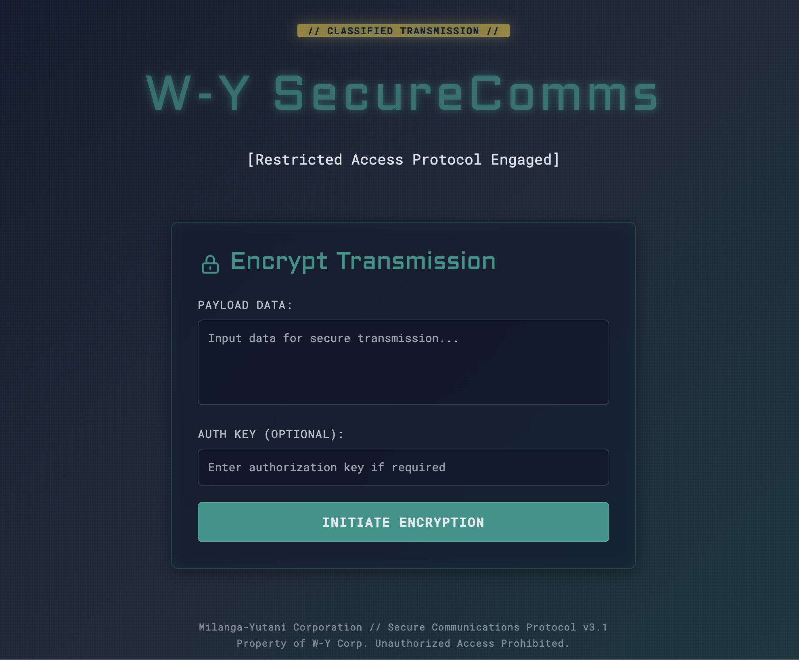
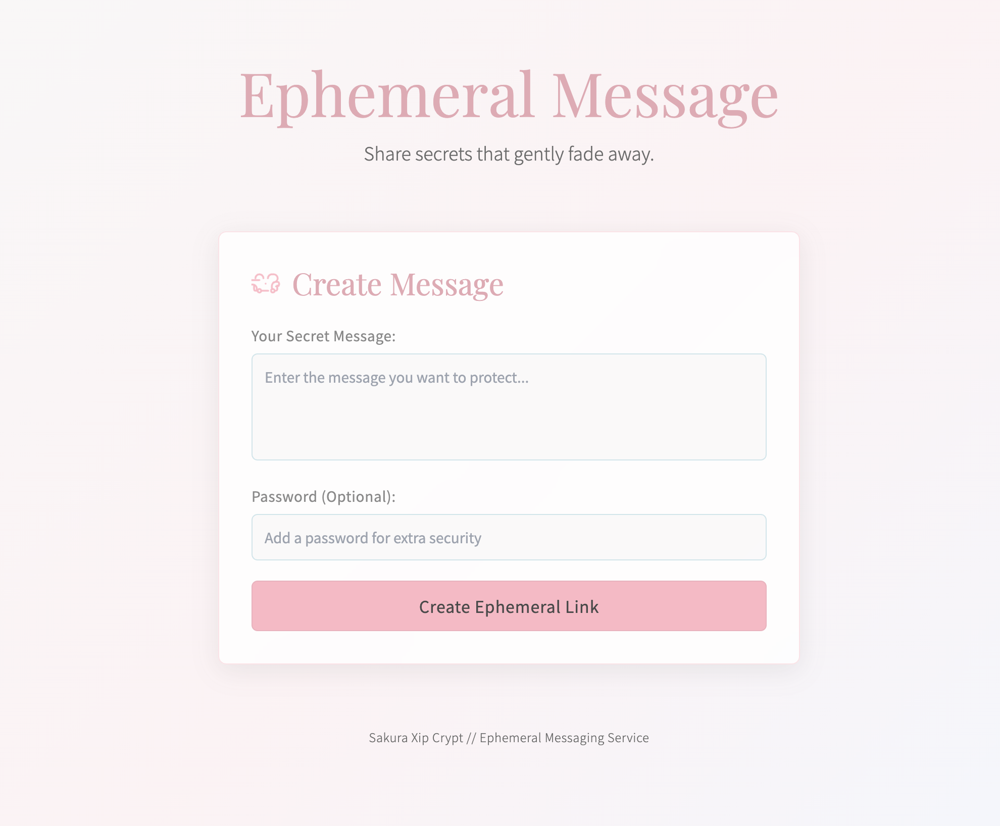

# TopSecret



TopSecret is an encryption and decryption service with a REST API.

It provides two primary methods of encryption:

1. **Auto encryption**: Generates keys automatically and stores them securely
2. **Passphrase encryption**: Uses a user-provided passphrase for more secure encryption

The project includes a FastAPI web service that expose encryption functionality through HTTP endpoints, allowing users to encrypt sensitive information and share decryption URLs.


## Documentation

Project documentation is available at [https://edvm.github.io/secrets-py/](https://edvm.github.io/secrets-py/).

## Sponsorship

A special thanks to [Hamkee](https://hamkee.net/) for sponsoring the project and providing hosting services.

If you find this project useful, consider supporting its development:
[](https://ko-fi.com/edvmfoss)


## Run API on three simple steps 

### Prerequisites

0- Python 3.10 or higher and `make` installed.

1- Install `uv` (Linux and MacOS)
```bash
curl -LsSf https://astral.sh/uv/install.sh | sh
```

2- Run `make install` to install dependencies.
```bash
make install
```

3- Run `make run` to start the API server.
```bash
make run
```

### Getting Started

Clone the repository:

```bash
git clone https://github.com/edvm/secrets-py.git
cd secrets-py
```

### Using the Makefile

The project includes a Makefile trying to make your life easier. You can use it to automate common tasks.

Be sure to have `make` and `uv` installed.

```bash
# Install dependencies
make install

# Run the API server
make run

# Run code quality checks (linting, type checking)
make check

# Run tests
make test

# Show all available commands
make help
```

### Running the API Server

After installation, start the API server:

```bash
make run
```

The API will be available at http://localhost:8000.

### Running with Docker Compose
If you prefer to run the API using Docker Compose, you can use the provided `compose.yml` file.
1. Build and run the Docker container:

```bash
docker compose up --build
```
2. Access the API at http://localhost:8000.

### Using curl

#### Testing the encrypt endpoint
```sh
# Example 1: Encrypt a secret without a passphrase
curl -X POST http://localhost:8000/encrypt \
  -H "Content-Type: application/json" \
  -d '{"secret": "This is my top secret message"}'

# Example 2: Encrypt a secret with a passphrase
curl -X POST http://localhost:8000/encrypt \
  -H "Content-Type: application/json" \
  -d '{"secret": "This is my password protected message", "passphrase": "mysecretpassword123"}'
```

#### Testing the decrypt endpoint
```sh
# Example 3: Decrypt a secret (replace HASH_VALUE with the actual hash from the encrypt response)
curl -X POST http://localhost:8000/decrypt/HASH_VALUE

# Example 4: Decrypt a passphrase-protected secret
curl -X POST http://localhost:8000/decrypt/HASH_VALUE \
  -H "Content-Type: application/json" \
  -d '{"passphrase": "mysecretpassword123"}'
```

### Skins / Themes

You can create your own skins by modifying the HTML and CSS files in the `static/themes` directory. Use `default.html` as base template and create your own theme by copying it to a new file, e.g., `mytheme.html`. Then, you can specify the theme by query parameter in the URL, e.g., `http://localhost:8000/encrypt?theme=mytheme` or override `default.html` with your
custom skin. 

Here are some screenshots of built-in themes:


